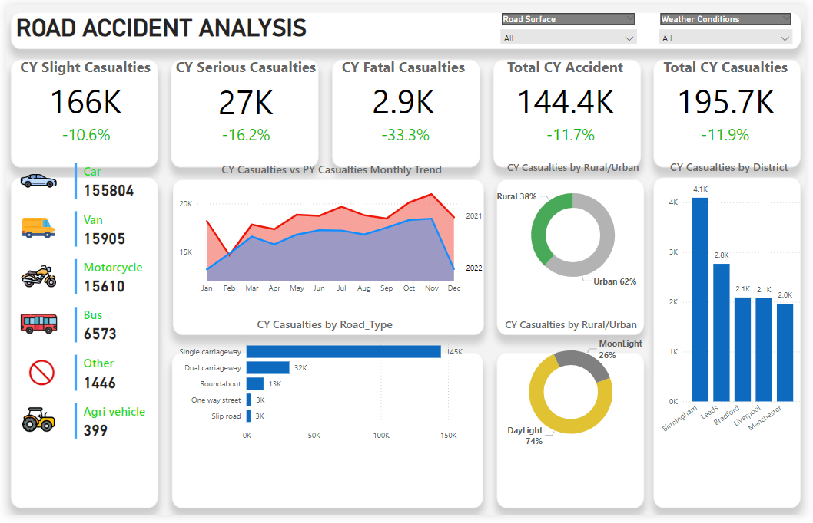

# Road Accident Analysis in England (2022-2023)

## Overview
This project delivers a comprehensive analysis of road accidents in England for 2022 and 2023. The objective was to create an interactive Power BI dashboard that provides actionable insights into accident trends, aiding stakeholders in identifying patterns and areas for safety improvement.

  
## Dashboard Overview


---

## Features
- **Interactive Dashboard**: Dynamic filtering by time period, location, and accident type.
- **Key Metrics**:
  - Total casualties and accidents for 2022 and 2023.
  - Year-over-year trends and comparisons.
  - Breakdown by accident severity, vehicle type, road type, and location.
- **Data Insights**:
  - Monthly trends and seasonality.
  - Urban vs. rural accident distribution.
  - Analysis by light conditions (day vs. night).

---

## Process
1. **Requirement Gathering**:
   - Defined key metrics (KPIs) and objectives based on stakeholder needs.
2. **Data Preparation**:
   - Cleaned and processed the raw dataset (2022-2023).
   - Developed a detailed data dictionary for clarity.
   - Established relationships and performed calculations using DAX for insights (e.g., YoY growth).
3. **Visualization Design**:
   - Designed intuitive visuals and interactive charts in Power BI.
   - Incorporated consistent themes and custom icons.
4. **Insights Generation**:
   - Summarized key findings to guide stakeholder decisions.


---

## DAX Calculations
Here are some of the DAX calculations used in this project:

1. **CY Accident**
   ```DAX
   CY Accident = TOTALYTD(COUNT(Data[Accident_Index]), 'Calendar'[Date])
   ```
   Calculates the total number of accidents for the current year (CY) by summing up the accident counts year-to-date.

2. **CY Casualties**
   ```DAX
   CY Casualties = TOTALYTD(SUM(Data[Number_of_Casualties]), 'Calendar'[Date])
   ```
   Calculates the total number of casualties for the current year (CY) by summing up the casualties year-to-date.

3. **LY Accident**
   ```DAX
   LY Accident = CALCULATE(COUNT(Data[Accident_Index]), SAMEPERIODLASTYEAR('Calendar'[Date]))
   ```
   Calculates the total number of accidents for the last year (LY) by counting accidents in the same period of the previous year.

4. **LY Casualties**
   ```DAX
   LY Casualties = CALCULATE(SUM(Data[Number_of_Casualties]), SAMEPERIODLASTYEAR('Calendar'[Date]))
   ```
   Calculates the total number of casualties for the last year (LY) by summing casualties in the same period of the previous year.
   
5. **YoY Accident**
   ```DAX
   YoY Accident = ([CY Accident] - [LY Accident]) / [LY Accident]
   ```
   Calculates the Year-over-Year (YoY) percentage change in the number of accidents by comparing the current year’s accidents to the previous year’s.

6. **YoY Casualties**
   ```DAX
   YoY Casualties = ([CY Casualties] - [LY Casualties]) / [LY Casualties]
   ```
   Calculates the Year-over-Year (YoY) percentage change in the number of casualties by comparing the current year’s casualties to the previous year’s.
---


---

## Files Included
1. **Road Accident Analysis.pbix**: The Power BI dashboard file.
2. **Road Accident Data.xlsx**: The dataset used for analysis.
3. **Icons.zip**: Custom icons used in the visuals.
4. **Data Dictionary.xlsx**: Documentation of dataset terms and columns.

---

## Contact
For questions, feedback, or collaboration:

- **Name:** Bahaa Medhat Wanas  
- **Email:** [bahaamedhat2022@gmail.com](mailto:bahaamedhat2022@gmail.com)  
- **LinkedIn:** [Bahaa Wanas](https://www.linkedin.com/in/bahaa-wanas-9797b923a)  

---
